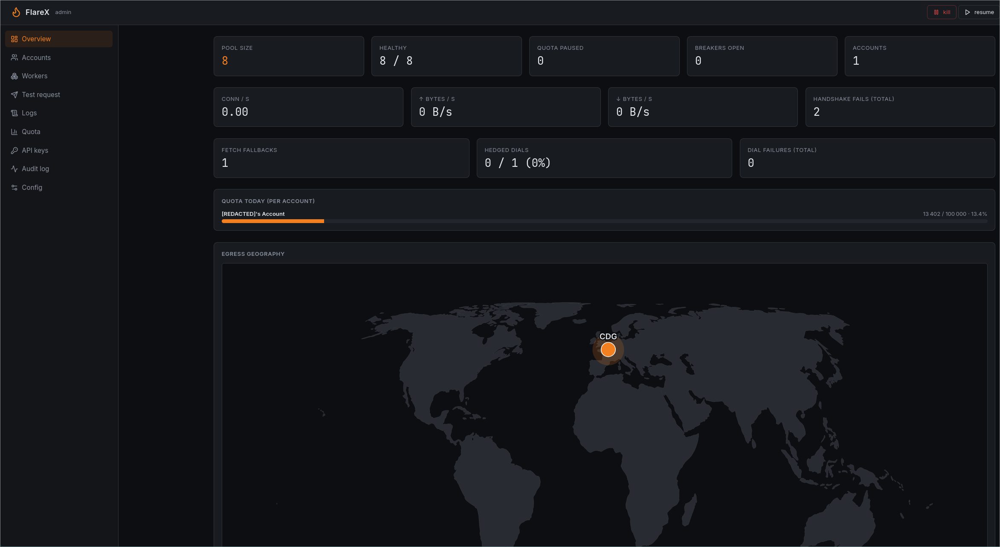
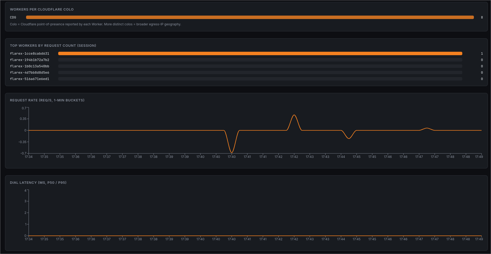
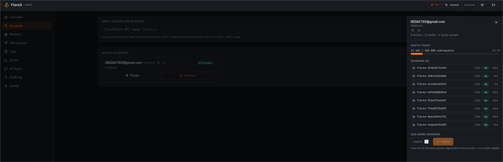
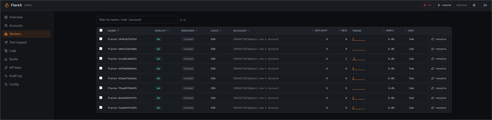
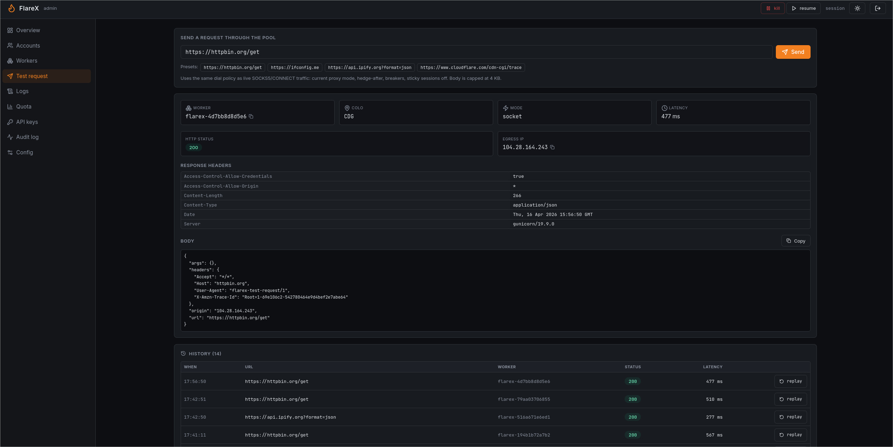
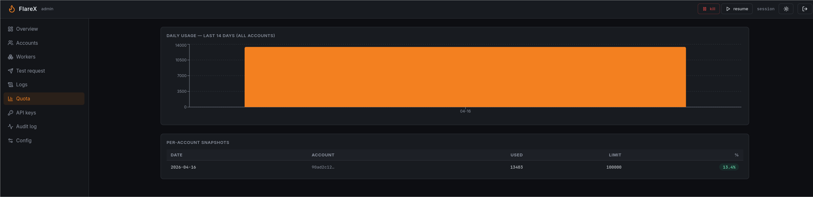
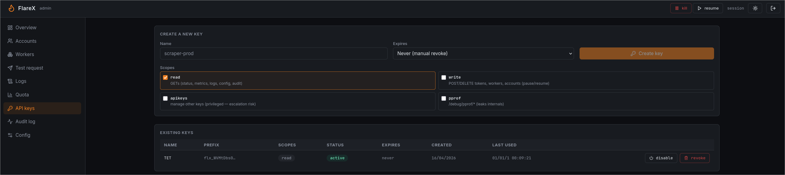
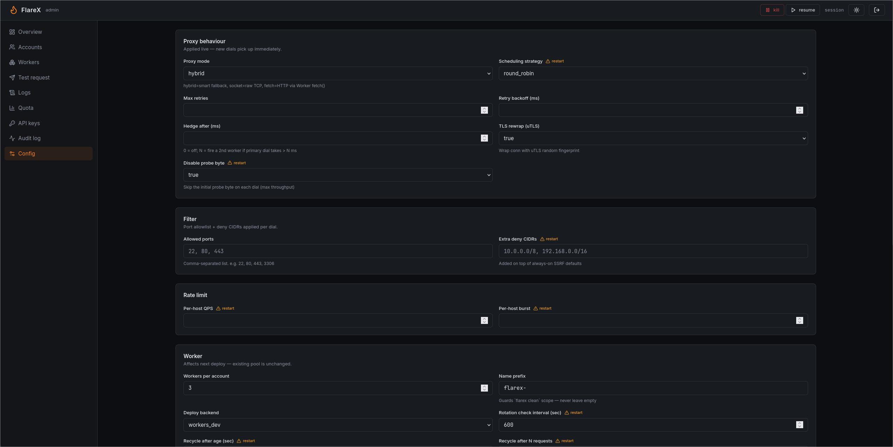
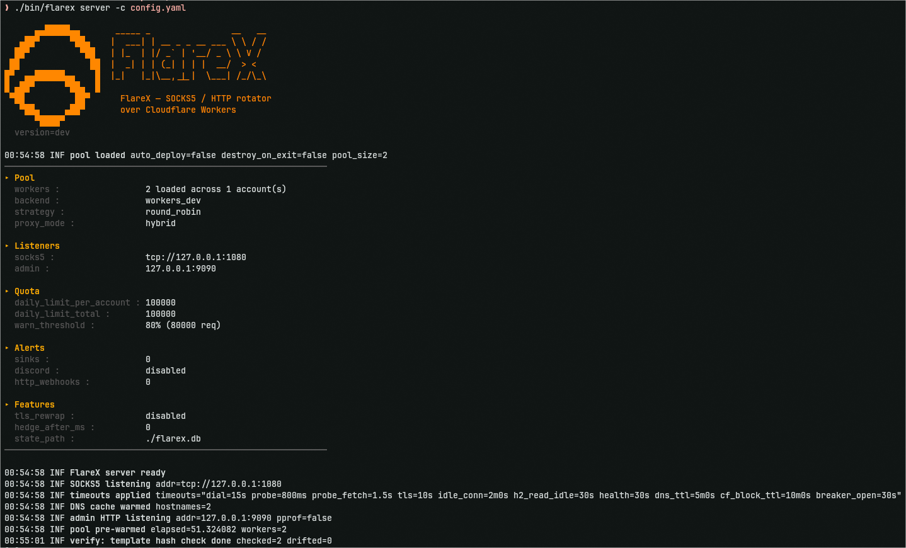

<div align="center">


# FlareX

**SOCKS5 / HTTP proxy that load-balances your traffic across a swarm of Cloudflare Workers.**

Single static Go binary. Zero CGO. Sub-millisecond local leg. Lock-free hot path. Built for fuzzing and large-scale scanning.

[](https://pkg.go.dev/github.com/Vozec/FlareX)
[](https://github.com/Vozec/FlareX/actions/workflows/ci.yml)
[](https://goreportcard.com/report/github.com/Vozec/FlareX)
[](LICENSE)

</div>

---

## What it does

```
ffuf / nuclei / curl ──SOCKS5──► FlareX ──┬──► Cloudflare Worker #1 ──► target
                                          ├──► Cloudflare Worker #2 ──► target
                                          └──► Cloudflare Worker #N ──► target
```

- **Local SOCKS5 server** on `:1080` (or UNIX socket).
- **Pool of Cloudflare Workers** auto-deployed via the CF API.
- Each Worker is a tunnel using `cloudflare:sockets` (raw TCP) with `fetch()` fallback for CF-hosted targets.
- Outbound IP visible to the target = **Cloudflare edge** (rotation across PoPs).
- Built-in **circuit breakers**, **hedged dials**, **cross-worker retry**, **per-target rate limit**, **auto-rotation**, **quota tracking with webhook alerts**.

> Not affiliated with or endorsed by Cloudflare. Cloudflare's Acceptable Use Policy restricts using Workers as proxies. Use at your own risk; rotate accounts; prefer paid Workers for sustained workloads.

## Install

```bash
go install github.com/Vozec/flarex/cmd/flarex@latest
```

Or build from source:

```bash
git clone https://github.com/Vozec/flarex
cd flarex
make build           # ./bin/flarex + ./bin/mockworker
```

### Shell completions

```bash
# bash
flarex completion bash | sudo tee /etc/bash_completion.d/flarex

# zsh
flarex completion zsh > "${fpath[1]}/_flarex"

# fish
flarex completion fish > ~/.config/fish/completions/flarex.fish

# pwsh
flarex completion pwsh | Out-String | Invoke-Expression
```

## Cloudflare prerequisites

1. A free Cloudflare account.
2. An API token with **`Account.Workers Scripts: Edit`** at minimum.
   The first run creates a `*.workers.dev` subdomain automatically if absent.
   For the optional custom-domain backend, also grant **`Zone.DNS: Edit`** on the target zones.
3. The token can drive **multiple accounts** if it has access; account ID and subdomain are auto-discovered (no need to hard-code).

> Detailed walkthrough: [docs/cloudflare-token.md](docs/cloudflare-token.md)

## 5-minute quick start

```bash
# 1) First run: bootstraps config.example.yaml from this repo into config.yaml
flarex server -c config.yaml
# exits with: "config freshly downloaded; edit it then re-run"

# 2) Open config.yaml, fill in:
#    - tokens: ["cf_api_token..."]      (or accounts: [...])
#    - security.hmac_secret: "<32+ char random>"
$EDITOR config.yaml

# 3a) Persistent mode: manage Workers separately
flarex deploy
flarex server -c config.yaml
# Ctrl-C leaves Workers deployed for next start
flarex destroy   # explicit cleanup

# 3b) Ephemeral mode: deploy at boot, destroy at exit (one-liner)
flarex server -c config.yaml --ephemeral

# 4) Use it
curl --socks5-hostname 127.0.0.1:1080 https://api.ipify.org
```

`--ephemeral` is shorthand for `--deploy --destroy-on-exit`. Both flags can be
used independently (e.g. `--deploy` only = redeploy on boot if state empty,
keep on exit).

`server` refuses to start while the config still contains template
placeholders (`change_me_*`, `your_cf_account_id`, ...). Replace them
with real values.

## Web admin UI

Set `admin.ui: true`, open `http://127.0.0.1:9090/ui/`, log in with your
`admin.api_key`. Everything is keyboard-friendly (Cmd+K palette).

<table>
  <tr>
    <td></td>
    <td></td>
  </tr>
  <tr>
    <td align="center"><sub>Overview: counters, throughput, fetch-fallback / hedge tiles</sub></td>
    <td align="center"><sub>Overview: egress geography (real map) + per-colo bars</sub></td>
  </tr>
  <tr>
    <td></td>
    <td></td>
  </tr>
  <tr>
    <td align="center"><sub>Accounts: pause / resume / remove / deploy more (no token re-auth)</sub></td>
    <td align="center"><sub>Workers: sortable, per-worker sparkline, recycle, click for drawer</sub></td>
  </tr>
  <tr>
    <td></td>
    <td></td>
  </tr>
  <tr>
    <td align="center"><sub>Test request: send any URL through the pool, see worker / colo / egress / latency</sub></td>
    <td align="center"><sub>Quota: daily subrequest usage, color-coded warn thresholds</sub></td>
  </tr>
  <tr>
    <td></td>
    <td></td>
  </tr>
  <tr>
    <td align="center"><sub>API keys: create scoped keys with TTL, raw shown once at creation</sub></td>
    <td align="center"><sub>Config: every supported field editable; live-applied vs restart flagged</sub></td>
  </tr>
</table>

Full UI walk-through with each tab + screenshots: [docs/admin-web-ui.md](docs/admin-web-ui.md).

## Documentation

Full docs live under [`docs/`](docs/README.md). Shortcuts:

| Topic | Doc |
|-------|-----|
| Every YAML / env knob explained | [configuration.md](docs/configuration.md) |
| CLI commands + subcommands (incl. backup/restore) | [cli.md](docs/cli.md) |
| Admin HTTP API (all endpoints) | [admin-api.md](docs/admin-api.md) |
| **Web admin UI walk-through + screenshots** | [admin-web-ui.md](docs/admin-web-ui.md) |
| socket / fetch / hybrid + byte-sniff | [proxy-modes.md](docs/proxy-modes.md) |
| What Workers can't do, why 4001 happens, AUP | [cloudflare-limitations.md](docs/cloudflare-limitations.md) |
| Docker, systemd, multi-region | [deployment.md](docs/deployment.md) |
| Prometheus, OpenTelemetry, alerts, pprof, Grafana dashboard | [observability.md](docs/observability.md) |
| Sticky sessions (BrightData-style) | [session-stickiness.md](docs/session-stickiness.md) |
| uTLS / JA3 rotation | [tls-rewrap.md](docs/tls-rewrap.md) |
| Internals: pool snapshot, breaker, drain | [architecture.md](docs/architecture.md) |
| Error to fix lookup | [troubleshooting.md](docs/troubleshooting.md) |
| Perf baseline + how to run | [benchmarks.md](docs/benchmarks.md) |
| Recipe book: 60+ copy-paste commands w/ output | [recipes.md](docs/recipes.md) |
| CF token setup walkthrough | [cloudflare-token.md](docs/cloudflare-token.md) |

### Startup output

<p align="center">
  
</p>

---

## Architecture

```
            ┌──────────────────────────────────────────────────────┐
            │              FlareX (local)               │
ffuf  ──►   │                                                      │
nuclei      │  ┌──────────┐  ┌──────────┐  ┌──────────────────┐    │
curl        │  │  SOCKS5  │─▶│scheduler │─▶│ dial + retry +   │    │
            │  │  :1080   │  │ (lockfree│  │ breaker + hedge  │    │
            │  └──────────┘  │ snapshot)│  └────────┬─────────┘    │
            │                └──────────┘           │              │
            │  ┌──────────┐                         │              │
admin ──►   │  │  HTTP    │  metrics / status      │ WS+HMAC      │
HTTP        │  │  :9090   │  /tokens (POST/DELETE) │              │
            │  └──────────┘                         │              │
            └───────────────────────────────────────┼──────────────┘
                                                    │
                              ┌─────────────────────┼─────────────────────┐
                              ▼                     ▼                     ▼
                       ┌─────────────┐      ┌─────────────┐        ┌─────────────┐
                       │  Worker A   │      │  Worker B   │        │  Worker N   │
                       │ (CF edge)   │      │ (CF edge)   │   ...  │ (CF edge)   │
                       │             │      │             │        │             │
                       │ connect()   │      │ connect()   │        │ connect()   │
                       │ + startTls()│      │ + startTls()│        │ + startTls()│
                       └──────┬──────┘      └──────┬──────┘        └──────┬──────┘
                              │                    │                      │
                              └────────────────────┼──────────────────────┘
                                                   ▼
                                                 target
```

### Hot path

1. Client opens SOCKS5; greeting parsed zero-alloc.
2. `CONNECT host:port` runs SSRF filter (patricia trie of RFC1918, loopback, link-local, CGNAT, cloud metadata, IPv6 ULA).
3. Per-target-host token bucket (xsync.MapOf).
4. `Pool.NextRR()` returns a Worker via `atomic.AddUint64` over a snapshot: **22 ns, zero alloc**.
5. `DialWithPolicy`: circuit breaker, optional hedge, exponential backoff cross-worker.
6. WS dial through a per-worker tuned `http.Transport` (HTTP/2 multiplex, large frame sizes, cached DNS).
7. Worker JS verifies HMAC (`ts|host|port|tls`, ±60 s window), `connect()` to target (+ optional `startTls()`), pipes WS to socket.
8. Bidirectional relay: `io.CopyBuffer` with pooled 32 KB buffers.

### Background loops

- Pre-warm h2 conns to every Worker at boot.
- Active health-check (`/__health`, every 30 s).
- Passive EWMA error rate (α = 0.3, threshold > 0.5 marks unhealthy).
- Auto-rotation: recycle Workers past configured age / request count.
- Quota tracker (daily reset UTC) with alerts (HTTP / Discord).

---

## CLI reference

### Server side

```
flarex deploy                     deploy N Workers per CF account
flarex destroy                    delete all Workers matching prefix
flarex clean [--dry-run]          destroy + DNS cleanup (prefix-scoped)
flarex list                       list deployed Workers
flarex server [-c config.yaml]    SOCKS5 + admin HTTP (alias: serve)
                  [--deploy] [--destroy-on-exit] [--ephemeral]
                  [--proxy-mode socket|fetch|hybrid]
flarex seed --name X --url URL    dev/test: seed local state
flarex backup --out snapshot.db   bbolt state snapshot (atomic, no downtime)
flarex restore --in snapshot.db   replace state.path (--force to overwrite)
flarex config validate            load + validate config.yaml without running
```

### Remote admin client

URL + credentials are persisted in `~/.config/flarex/client.yaml`
(override with `FLX_CLIENT_CONFIG`).

```
flarex client login --url http://srv:9090 --api-key XXX
flarex client login --url http://srv:9090 --user U --pass P
flarex client login --url http://srv:9090 --bearer XXX

flarex client whoami
flarex client status
flarex client metrics
flarex client health
flarex client add-token --token cf_xxx
flarex client remove-token --account abc
flarex client logout
```

---

## Admin HTTP

When `admin.addr` is set, the daemon exposes the surface below. Full
contract + JSON shapes: [docs/admin-api.md](docs/admin-api.md).

| Method | Path | What |
|--------|------|------|
| GET | `/health` | liveness (public) |
| GET | `/status` | pool snapshot (workers, breaker, inflight, errors, EWMA, colo) |
| GET | `/accounts` | per-account aggregate (id, name, healthy ratio, quota_paused count) |
| GET | `/metrics` | Prometheus text, `cft_*` series |
| GET | `/metrics/series` | in-memory ring (15-s samples × 60), feeds the SPA charts |
| GET | `/metrics/history?days=N&account=ID` | persisted daily quota snapshots |
| GET | `/audit?limit=N` | last N admin mutations (who / action / target / detail) |
| GET / PATCH | `/config` | sanitized dump (GET) · live edit (PATCH `{path,value}`) |
| POST | `/config/proxy-mode` | swap pool.proxy_mode at runtime |
| POST / DELETE | `/tokens` | runtime add (validated + dedup) / remove |
| POST | `/accounts/{id}/pause` · `/resume` · `/deploy` | mass-toggle quota / scale w/o re-auth |
| POST | `/workers/{name}/recycle` | graceful drain + redeploy |
| GET | `/workers/{name}/logs` | SSE, Cloudflare Tail API |
| GET / POST / PATCH / DELETE | `/apikeys[/{id}]` | scoped key CRUD (rate-limited) |
| POST | `/test-request` | route a URL through the pool, returns worker / colo / egress / latency |
| GET | `/test-history` | last 100 test-request runs |
| POST | `/alerts/webhook` | Alertmanager forwards to Discord/HTTP webhooks |
| POST / DELETE | `/session` | login (sets HttpOnly cookie + CSRF) / logout |
| GET | `/ui/*` | embedded React SPA (when `admin.ui: true`) |
| GET | `/debug/pprof/*` | profiling, gated by `admin.enable_pprof` |

### Auth

| Surface | Mechanism |
|---------|-----------|
| Web UI session | `flarex_session` HttpOnly cookie (HMAC-signed) + `X-CSRF-Token` (double-submit) |
| 2FA | `admin.totp_secret`: when set, login also requires a 6-digit TOTP code |
| API callers | `Authorization: Bearer <admin.token>` · `X-API-Key: <admin.api_key>` · HTTP Basic · scoped named keys (`flx_…`) |
| Brute-force | 10 failed logins / 60 s per IP triggers 5 min 429 |

Bootstrap credentials grant **all scopes**. Mint scoped keys (`read`,
`write`, `apikeys`, `pprof`) under the **API keys** tab and revoke the
bootstrap once you don't need it for recovery.

If no auth is configured at all the API runs open. Only safe bound to
`127.0.0.1`.

---

## Configuration

Annotated reference: see [`config.example.yaml`](config.example.yaml).

Key sections:

```yaml
tokens:                       # bare tokens; accounts + subdomain auto-discovered
  - "cf_api_token..."

worker:
  name_prefix: "flarex-"
  count: 5                    # Workers per account/zone
  deploy_backend: "auto"      # auto | workers_dev | custom_domain
  rotate_max_age_sec: 0       # auto-rotation triggers
  rotate_max_req: 0

filter:
  allow_ports: [80, 443, 8080, 8443]   # or ["*"] for all
  deny_cidrs: []                        # extras on top of RFC1918/etc

pool:
  strategy: round_robin       # round_robin | least_inflight
  hedge_after_ms: 0           # 0=off ; e.g. 100 = race a 2nd worker after 100ms
  max_retries: 3
  goroutine_size: 0           # 0=unbounded ; N=ants pool

rate_limit:
  per_host_qps: 0             # 0=off ; per-target-host token bucket

quota:
  daily_limit: 100000         # 0=off ; CF Workers free tier limit
  warn_percent: 80

alerts:
  cooldown_sec: 900
  discord_webhook_url: ""
  http_webhooks:
    - url: "https://my-webhook"
      headers: { X-Auth: "x" }

admin:
  addr: "127.0.0.1:9090"
  api_key: ""                 # X-API-Key
  basic_user: ""              # Basic auth
  basic_pass: ""
  token: ""                   # Bearer
  enable_pprof: false

security:
  hmac_secret: "..."          # 32+ chars random; FLX_HMAC_SECRET overrides
```

Environment variables:

| Var | Purpose |
|-----|---------|
| `FLX_CONFIG` | Server config path |
| `FLX_HMAC_SECRET` | HMAC secret (overrides `security.hmac_secret`) |
| `FLX_CONFIG_EXAMPLE_URL` | Where `server` fetches the example config when missing |
| `FLX_CLIENT_CONFIG` | Client-side persisted URL+credentials path |

---

## Backends

The deploy target is pluggable per account. Auto-selected unless overridden.

| Backend | URL pattern | When auto-picked |
|---------|-------------|------------------|
| `workers_dev` | `flarex-XXX.{cf-subdomain}.workers.dev` | Account has no zones (or `deploy_backend: workers_dev`) |
| `custom_domain` | `flarex-XXX.{your-zone}` (flat 1-level prefix) | Account has at least one CF zone (or `deploy_backend: custom_domain`) |

Custom-domain mode auto-creates the DNS record via the Workers Domains API and
removes it on `destroy` / `clean`. Cleanup is **prefix-scoped**: only records
starting with `worker.name_prefix` are touched, so unrelated DNS in your zone
is safe.

---

## Docker

### Production

`deploy/docker-compose.yml` is a Portainer-friendly single-service stack with
healthcheck, resource limits, and persistent state volume.

```bash
export FLX_HMAC_SECRET=$(openssl rand -hex 32)
docker-compose -f deploy/docker-compose.yml up -d
```

systemd unit + setup steps are documented in [`deploy/README.md`](deploy/README.md).

### E2E test (no real Cloudflare)

`test/deploy/docker-compose.yml` spins up the full chain: a stub mock Worker,
nginx target, the proxy with seeded state, and a curl-based bench validator.
Useful for CI.

```bash
make docker-bench
# or
docker-compose -f test/deploy/docker-compose.yml up --build --exit-code-from bench
```

---

## Benchmarks

Local, AMD Ryzen 7 5800X, GOMAXPROCS=16, single mockworker, no real CF.

```
BenchmarkE2E-16                                       160 µs/op   (≈ 6 250 RPS / thread)
BenchmarkThroughput/conc=200-16                  10 255 RPS sustained, 1 backend mock
BenchmarkPoolNextRR_Parallel-16                       22 ns/op   0 B/op   0 allocs/op
BenchmarkPoolAll-16                                  0.05 ns/op   (atomic.Pointer load)
```

Run yourself:

```bash
make bench
./scripts/bench_local.sh 50 500     # 500 reqs, 50 concurrent, end-to-end via mock
```

---

## Tests

```bash
make test          # unit + integration
make test-race     # + race detector
make cover         # HTML coverage report
make lint          # go vet + golangci-lint config
```

Integration test `TestEndToEnd_SOCKS5_ThroughMockWorker` spins the full chain
(client, SOCKS5, mock CF Worker (WS+HMAC+TCP), target HTTP) in-process and
asserts the response body.

---

## Highlights

| | |
|---|---|
| **Single binary** | Static, zero-CGO. `go install ...` and you're done. SPA admin embedded; no Node at runtime. |
| **Fast local leg** | Lock-free pool snapshot (atomic.Pointer), lazy HTTP/2 transports, cached DNS, goroutine pool, sync.Pool relay buffers. |
| **Fault tolerant** | Per-worker circuit breaker + EWMA passive health + active `/__health` ping + cross-worker retry + hedged dials. |
| **Pluggable backends** | `workers.dev` (default) **or** custom domain on your own CF zone (auto-detected). |
| **Lifecycle managed** | Deploy / destroy / list / clean / runtime add+remove / runtime config edits via UI. |
| **Web admin UI** | React SPA at `/ui/`: live charts, per-worker / per-account drawers, editable config, test-request, Cmd+K palette, geo-map, audit + CSV export. Optional 2FA TOTP. |
| **Observability** | Prometheus `/metrics`, `/status`, `/metrics/series`, pprof, OpenTelemetry traces, structured logs (zerolog), bundled Grafana dashboard. |
| **Quota alerts** | Per-account daily limits, warn threshold, HTTP + Discord webhooks with cooldown dedup, Alertmanager webhook bridge. |
| **Remote admin** | `flarex client` for status/metrics/add-token/remove-token, plus `flarex backup` / `restore` for the bbolt state. |
| **Auth** | Cookie session (HttpOnly + CSRF) for the SPA; Bearer / X-API-Key / HTTP Basic for everything else; scope-bound named keys with optional TTL. |

---

## Acknowledgements

Inspired by:

- [rota](https://github.com/alpkeskin/rota): proxy rotator
- [flareprox](https://github.com/MrTurvey/flareprox): original CF Workers proxy idea
- [Workers-Proxy](https://github.com/aD4wn/Workers-Proxy): Worker template patterns

## License

Apache-2.0: see [LICENSE](LICENSE).

## Contributing

See [CONTRIBUTING.md](CONTRIBUTING.md).
